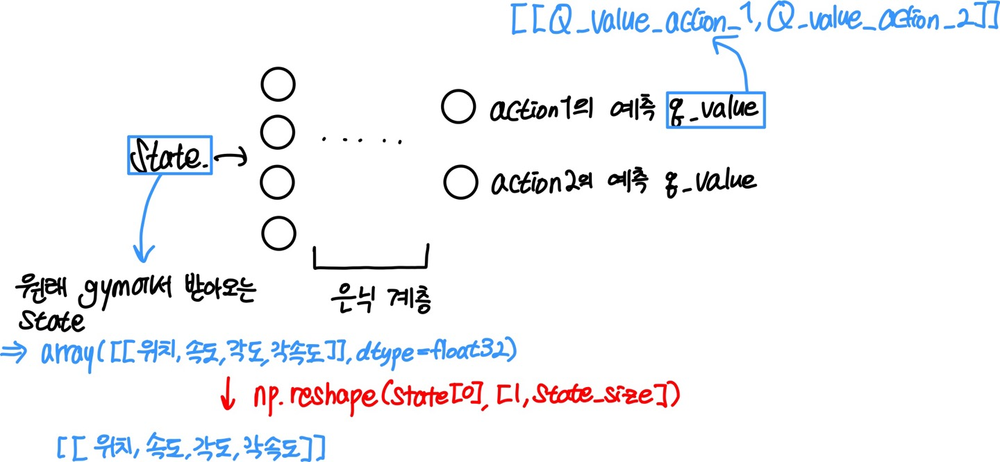
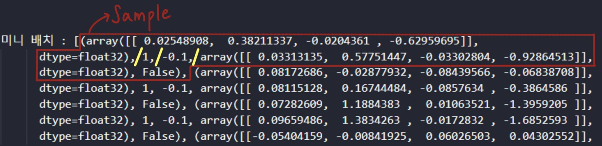
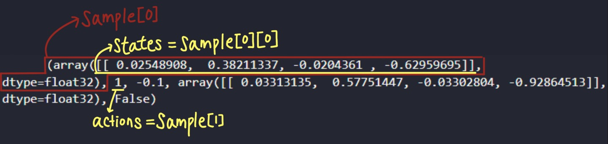

## **DQN**

### **DQN과 Q-learning의 차이**
- **Q-learning** : 벨만 방정식을 사용해 반복적인 업데이트를 통해 Q-값을 예측한다.
- **DQN** : Q-러닝의 개념을 심층 신경망에 적용한 것이다. 이 방법은 입력으로 입력 상태를 받아 각 행동에 대한 Q-값을 출력으로 반환하는 ANN(인공신경망)을 사용해 Q-값을 예측한다.
  
<br>

### **DQN 알고리즘의 주요 특징**
**1. 경험 리플레이** : 에이전트가 환경과 상호작용 하면서 얻는 샘플(s,a,r,s')들을 메모리에 저장했다가 에이전트가 학습할 때 모인 샘플들 중 여러 개의 샘플을 무작위로 뽑아 인공신경망을 업데이트한다. 리플레이 메모리는 크기가 정해져 있어서 메모리가 꽉 차면 가장 먼저 들어온 샘플부터 메모리에서 삭제한다.

<br>


<br>

**2. 타겟 네트워크** 
- **타겟 값** : 이상적으로 원하는 예측
$$R(s_t,a_t)+\gamma \max_{a} (Q(s_{t+1}, a))$$
- **주 네트워크** : 현재 상태에서의 Q-값을 예측
- **타겟 네트워크** : 타겟 값을 계산. 타겟 네트워크는 학습 과정에서 주 네트워크의 업데이트가 너무 빠르게 일어나면서 발생할 수 있는 발산 문제를 완화하는 데 도움을 줌. 보통 주 네트워크의 가중치를 타겟 네트워크에 주기적으로 복사하면서 타겟 네트워크를 업데이트하는데 이를 통해 주 네트워크가 학습하는 동안 타겟 네트워크의 출력이 일정 기간 동안 안정적으로 유지되도록 하기 위함이다. 즉, 주 네트워크가 빠르게 변하는 동안에도 일정한 목표를 향해 학습할 수 있는 "기준점"을 제공한다.
- **손실 함수** : 학습 과정에서 신경망의 예측이 실제 값(타겟 값)과 얼마나 차이나는지를 측정하는 데 사용된다. 이 함수를 이용해 예측과 타겟의 오차를 줄여 나간다.
$$\mathbb{E}[(타겟-Q(s_t,a_t))^2]$$

<br>


<br>


### **전체 알고리즘**
1. 현재 상태 $s_t$의 Q-값을 예측한다.
2. 선택된 행동 $a_t$를 수행한다.
3. 보상 $R(s_t,a_t)$을 받는다.
4. 다음 상태 $s_{t+1}$에 도달한다.
5. 메모리에 전이 $(s_t,a_t,r_t,s_{t+1})$을 추가한다.
6. 메모리에서 무작위로 선택한 전이로 배치 B를 구성한다. 무작위 배치 B의 $(s_{tB},a_{tB},r_{tB},s_{tB+1})$ 전이 전체에 대해
- 예측을 가져온다 : $Q(s_{tB},a_{tB})$
- 타깃을 가져온다 : $R(s_{tB},a_{tB})+\gamma \max_{a} (Q(s_{tB+1}, a))$
- 전체 배치 B에서 예측과 타깃 사이의 손실을 계산한다.
- 경사 하강법을 통해 손실 오차를 줄이기 위해 가중치를 업데이트한다.

<br>

### **Cartpole 예제 환경**

<br>


**1. 상태(state)**
- 카트의 위치
- 카트의 속도
- 막대기의 각도
- 막대기의 각속도

**2. 행동(action)**
- 매 스텝마다 0,1의 값을 통해 카트를 좌, 우로 조종할 수 있다.

**3. 보상(reward)**
- 매 스텝마다 카트가 중심을 기준으로 일정 범위 안에 있고, 막대기가 넘어지지 않으면 +1의 보상을 받는다.

<br>

### **Carpole 예제 코드 알고리즘**
**1. DQN 신경망 모델 정의 : class DQN(tf.keras.Model)**
- 'DQN' 클래스를 정의하여 상태를 입력으로 받고, 가능한 각 행동에 대한 Q-값을 출력하는 신경망을 생성한다.

**2. DQN 에이전트 정의 : class DQNAgent**
- **def update_target_model** : 타겟 모델을 모델의 가중치로 업데이트하는 함수 
- **def get_action** : 입실론 탐욕 정책으로 행동 선택

<br>



<br>

출력되는 q값의 shape이 저러니까 입실론 탐욕 정책을 사용할 때 q값이 가장 높은 action을 선택할 때 어떻게 해야할지 잘 생각해 보아야 한다.

<br>

- **def append_sample** : 리플레이 메모리에 저장 (s,a,r,s',done)
- **def train_model** : 리플레이 메모리에서 무작위로 추출한 배치로 모델 학습
- **리플레이 메모리에 저장된 형태**

<br>

```python
def append_sample(self, state, action, reward, next_state, done):
  self.memory.append((state, action, reward, next_state, done))
```
  
<br>

```python
mini_batch = random.sample(self.memory, self.batch_size)

states = np.array([sample[0][0] for sample in mini_batch])
actions = np.array([sample[1] for sample in mini_batch])
rewards = np.array([sample[2] for sample in mini_batch])
next_states = np.array([sample[3][0] for sample in mini_batch])
dones = np.array([sample[4] for sample in mini_batch])
```



<br>




**3. 학습 과정**
- 각 에피소드마다 환경을 초기화하고, 에피소드가 끝날 때까지 다음을 반복한다.
    - 에이전트로부터 현재 상태에 기반한 행동을 선택 받는다.
    - 선택한 행동을 환경에 적용하고, 새로운 상태, 보상, 에피소드 종료 여부를 받는다.
    - 이 경험을 리플레이 메모리에 저장한다.
    - 메모리에 충분한 샘플이 쌓이면, 무작위로 샘플을 추출하여 에이전트를 학습시킨다.

<br>

### **Carpole 예제 코드**

```python
import os
import sys
import gymnasium as gym
import pylab
import random
import numpy as np
from collections import deque
import tensorflow as tf
from tensorflow.keras.layers import Dense
from tensorflow.keras.optimizers import Adam
from tensorflow.keras.initializers import RandomUniform
import matplotlib.pyplot as plt
import pygame

# 상태가 입력, 큐함수가 출력인 인공신경망 생성
class DQN(tf.keras.Model):
    def __init__(self, action_size):
        super(DQN, self).__init__()
        self.fc1 = Dense(24, activation='relu')
        self.fc2 = Dense(24, activation='relu')
        self.fc_out = Dense(action_size,
                            kernel_initializer=RandomUniform(-1e-3, 1e-3))

    def call(self, x):
        x = self.fc1(x)
        x = self.fc2(x)
        q = self.fc_out(x)
        return q


# 카트폴 예제에서의 DQN 에이전트
class DQNAgent:
    def __init__(self, state_size, action_size):
        self.render = True

        # 상태와 행동의 크기 정의
        self.state_size = state_size
        self.action_size = action_size

        # DQN 하이퍼파라미터
        self.discount_factor = 0.99
        self.learning_rate = 0.001
        self.epsilon = 1.0
        self.epsilon_decay = 0.999
        self.epsilon_min = 0.01
        self.batch_size = 64
        self.train_start = 1000

        # 리플레이 메모리, 최대 크기 2000
        self.memory = deque(maxlen=2000)

        # 모델과 타깃 모델 생성
        self.model = DQN(action_size)
        self.target_model = DQN(action_size)
        self.optimizer = Adam(lr=self.learning_rate)

        # 타깃 모델 초기화
        self.update_target_model()

    # 타깃 모델을 모델의 가중치로 업데이트
    def update_target_model(self):
        self.target_model.set_weights(self.model.get_weights())

    # 입실론 탐욕 정책으로 행동 선택
    def get_action(self, state):
        # Write Your Code 1

    # 샘플 <s, a, r, s', done>을 리플레이 메모리에 저장
    def append_sample(self, state, action, reward, next_state, done):
        self.memory.append((state, action, reward, next_state, done))

    # 리플레이 메모리에서 무작위로 추출한 배치로 모델 학습
    def train_model(self):
        if self.epsilon > self.epsilon_min:
            self.epsilon *= self.epsilon_decay

        # 메모리에서 배치 크기만큼 무작위로 샘플 추출
        mini_batch = random.sample(self.memory, self.batch_size)

        states = np.array([sample[0][0] for sample in mini_batch])
        actions = np.array([sample[1] for sample in mini_batch])
        rewards = np.array([sample[2] for sample in mini_batch])
        next_states = np.array([sample[3][0] for sample in mini_batch])
        dones = np.array([sample[4] for sample in mini_batch])

        # 학습 파라메터
        model_params = self.model.trainable_variables
        with tf.GradientTape() as tape:
            # 현재 상태에 대한 모델의 큐함수
            predicts = self.model(states)
            # print(predicts.shape)
            one_hot_action = tf.one_hot(actions, self.action_size)
            predicts = tf.reduce_sum(one_hot_action * predicts, axis=1)

            # 다음 상태에 대한 타깃 모델의 큐함수
            target_predicts = self.target_model(next_states)
            target_predicts = tf.stop_gradient(target_predicts)

            # 벨만 최적 방정식을 이용한 업데이트 타깃
            max_q = np.amax(target_predicts, axis=-1)
            targets = rewards + (1 - dones) * self.discount_factor * max_q
            # print("targets", targets.shape)
            # print("predicts", predicts)
                  
            loss = tf.reduce_mean(tf.square(targets - predicts))
            # print("loss", loss)

        # 오류함수를 줄이는 방향으로 모델 업데이트
        # print("model_params", model_params)
        grads = tape.gradient(loss, model_params)
        self.optimizer.apply_gradients(zip(grads, model_params))


if __name__ == "__main__":
    # CartPole-v1 환경, 최대 타임스텝 수가 500
    env = gym.make('CartPole-v1')
    # env = gym.make('CartPole-v1', render_mode = 'human')
    state_size = env.observation_space.shape[0]
    action_size = env.action_space.n
    scores, episodes = [], []
    
    # DQN 에이전트 생성
    agent = DQNAgent(state_size, action_size)

    scores, episodes = [], []
    score_avg = 0

    num_episode = 1000
    for e in range(num_episode):
        if e > 100:
            env = gym.make('CartPole-v1',render_mode='human')
        done = False
        score = 0
        # env 초기화
        state = env.reset()
        state = np.reshape(state[0], [1, state_size])
        count = 1
        Left, Right = False, False
        timestep = 0
        while not done:
            if agent.render:
                env.render()

            # 현재 상태로 행동을 선택
            # Write Your Code 2

            # 선택한 행동으로 환경에서 한 타임스텝 진행
            # Write Your Code 3
                
            next_state = np.reshape(next_state, [1, state_size])
            
            #set new done with less consideration with angle
            # transform reward system so that it repeats left and right while maintaining balance
            pos = next_state[0][0]
            vel = next_state[0][1]
            angle = next_state[0][2]
            angle_vel = next_state[0][3]
            
            timestep +=1
            # get less consideration with angle
            if (pos>-2.4 and pos<2.4) and (angle>-0.4 and angle<0.4):
                done = False
                
                if pos < -0.1 and angle > 0 and angle_vel <= 0:
                    Left = True
                    if Right == True:
                        count += 1
                        Right = False
                        if vel > 0:
                            reward = abs(pos)*0.5
                        else:
                            reward = count
                    else:
                        reward = count
                        
                    
                elif pos > 0.1 and angle < 0 and angle_vel >=0:
                    Right = True
                    
                    if Left == True:
                        count += 1
                        Left = False
                        if vel < 0:
                            reward = abs(pos)*0.1
                        else:
                            reward = count
                    else:
                        reward = count
                else:
                    reward = -0.1
                    
                
                
                if timestep == 500:
                    done = True
            else:
                reward = -1
                done = True
                Left = False
                Right = False
                
                
            score += reward

            # 리플레이 메모리에 샘플 <s, a, r, s', done> 저장
            # Write Your Code 4 

            # 매 타임스텝마다 학습
            if len(agent.memory) >= agent.train_start:
                # Write Your Code 5

            state = next_state

            if done:
                # 각 에피소드마다 타깃 모델을 모델의 가중치로 업데이트
                # Write Your Code 6

                # 에피소드마다 학습 결과 출력
                print("count", count)
                score_avg = 0.9 * score_avg + 0.1 * score if score_avg != 0 else score
                print("episode: {:3d} | score avg: {:3.2f} | memory length: {:4d} | epsilon: {:.4f}".format(
                      e, score_avg, len(agent.memory), agent.epsilon))
                scores.append(score)
                episodes.append(e)


                # 이동 평균이 400 이상일 때 종료
                if score_avg > 400 or e == num_episode-1:
                    agent.model.save_weights("./save_model/model", save_format="tf")
                    sys.exit()
```
